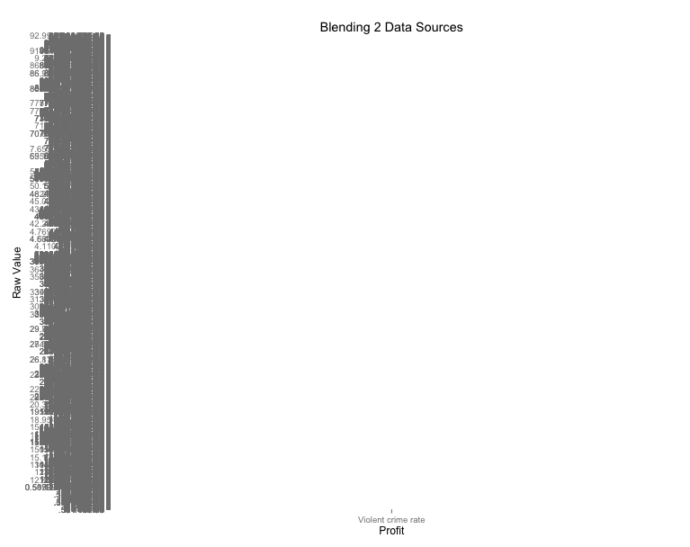
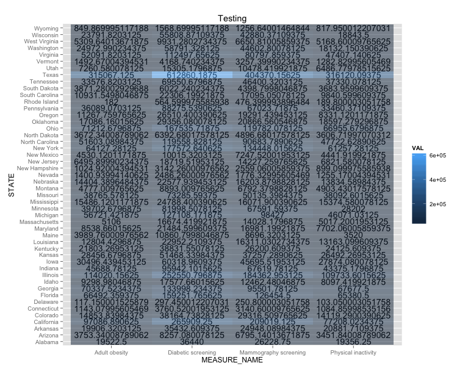
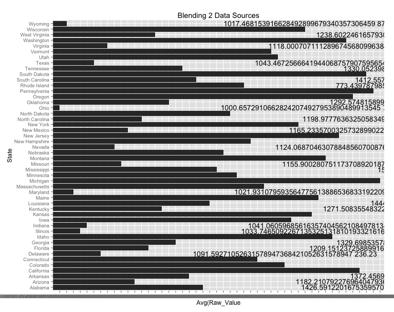

##1st STEP
*First We created a **.Rprofile.R ** document at the same level as our R script to run the needed packages. This document includes the packages required for the project. First We created a **.Rprofile.R ** document at the same level as our R script to run the needed packages. This document includes the packages required for the project. Next we loaded our csv files into Oracle using a modified verstoin of R_ETL.R*

```{r, eval=FALSE}
require(tidyr)
require(dplyr)
require(ggplot2)

file_path <- "County_Health_Rankings."

df <- read.csv(file_path, stringsAsFactors = FALSE)

# Replace "." (i.e., period) with "_" in the column names.
names(df) <- gsub("\\.+", "_", names(df))
names(df)
# str(df) # Uncomment this and  run just the lines to here to get column types to use for getting the list of measures.

#measures <- c("State", "County", "Year_Span", "Measure_name", "Raw_value")
#measures <- NA # Do this if there are no measures.

# Get rid of special characters in each column.
# Google ASCII Table to understand the following:
for(n in names(df)) {
    df[n] <- data.frame(lapply(df[n], gsub, pattern="[^ -~]",replacement= ""))
}

dimensions <- setdiff(names(df), measures)
if( length(measures) > 1 || ! is.na(dimensions)) {
  for(d in dimensions) {
    # Get rid of " and ' in dimensions.
    df[d] <- data.frame(lapply(df[d], gsub, pattern="[\"']",replacement= ""))
    # Change & to and in dimensions.
    df[d] <- data.frame(lapply(df[d], gsub, pattern="&",replacement= " and "))
    # Change : to ; in dimensions.
    df[d] <- data.frame(lapply(df[d], gsub, pattern=":",replacement= ";"))
  }
}

library(lubridate)
# Fix date columns, this needs to be done by hand because | needs to be correct.
#                                                        \_/
#df$Order_Date <- gsub(" [0-9]+:.*", "", gsub(" UTC", "", mdy(as.character(df$Order_Date), tz="UTC")))
#df$Ship_Date  <- gsub(" [0-9]+:.*", "", gsub(" UTC", "", mdy(as.character(df$Ship_Date),  tz="UTC")))

# The following is an example of dealing with special cases like making state abbreviations be all upper case.
# df["State"] <- data.frame(lapply(df["State"], toupper))

# Get rid of all characters in measures except for numbers, the - sign, and period.dimensions
if( length(measures) > 1 || ! is.na(measures)) {
  for(m in measures) {
    df[m] <- data.frame(lapply(df[m], gsub, pattern="[^--.0-9]",replacement= ""))
  }
}

write.csv(df, paste(gsub(".csv", "", file_path), ".reformatted.csv", sep=""), row.names=FALSE, na = "")

tableName <- gsub(" +", "_", gsub("[^A-z, 0-9, ]", "", gsub(".csv", "", file_path)))
sql <- paste("CREATE TABLE", tableName, "(\n-- Change table_name to the table name you want.\n")
if( length(measures) > 1 || ! is.na(dimensions)) {
  for(d in dimensions) {
    sql <- paste(sql, paste(d, "varchar2(4000),\n"))
  }
}
if( length(measures) > 1 || ! is.na(measures)) {
  for(m in measures) {
    if(m != tail(measures, n=1)) sql <- paste(sql, paste(m, "number(38,4),\n"))
    else sql <- paste(sql, paste(m, "number(38,4)\n"))
  }
}
sql <- paste(sql, ");")
cat(sql)
``` 


##2nd STEP
*We then found a second data set, county health rankings, to blend with our first data set superstore. Below is the summary of each data set.*

####DATA Summary for County Health Rankings and Superstore csv files
*The first data set shows health rankings per state in each state county. These health rankings were collected during a particular year span and were given a raw value amongst the various measure names. Measure names in the case are the different types of measured categories such as violent crime, premature death, diabetic screening, etc. *
```{r}
  health <-read.csv("../01 Data/County_Health_Rankings.csv")
  head(health)
  summary(health)
``` 

*The second data set was a data set previously used in the the first tableau project. It shows profits, shipping cost and other various measures. Each of these measures can be matched to a specific state, region, city or postal code.* 
```{r}
  superstore <-read.csv("../01 Data/Superstore.reformatted.csv")
  head(superstore)
  summary(superstore)
``` 

##3rd Step: Data Visualizations
*The follwoing data visualizations were created in tableau and R. An inner join was implemented on countyhealth and superstore state values.*

#Scatter Plot: Violent crime rates vs. Profit
*This plot indicates a trend between violent crime rate and income. This image did not fully visualize our data because R could not handle mroe than 100,000 rows of data so the entire image could not be rendered.*


#Crosstab with KPI: State vs Measure Names
*This visualization was aimed to identify the values of adult obesity, diabetic screening, mammography screening and physical activity according to state provinces within Texas. The KPI implemented set the maximum value at 100,000.*


#Bar Chart: Sales vs Average Raw Value
*This plot shows state raw values. Here we see that Oregon, Massachusetts, South Dakota and California have high raw values across all measured values.*

